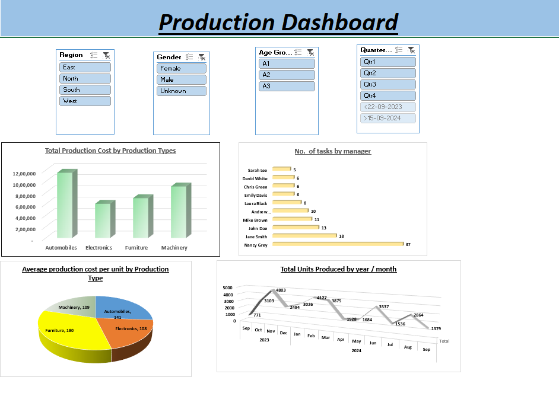

# Excel-dashboard
Interactive Excel Dashboard analyzing manufacturing data using PivotTables, formulas, and visualizations. Provides insights into production trends, costs, product categories, and manager-wise performance, helping transform raw data into meaningful business insights for data-driven decision-making.

